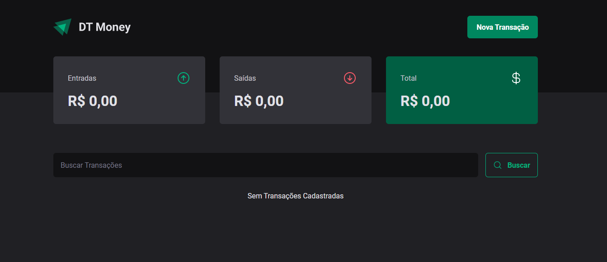
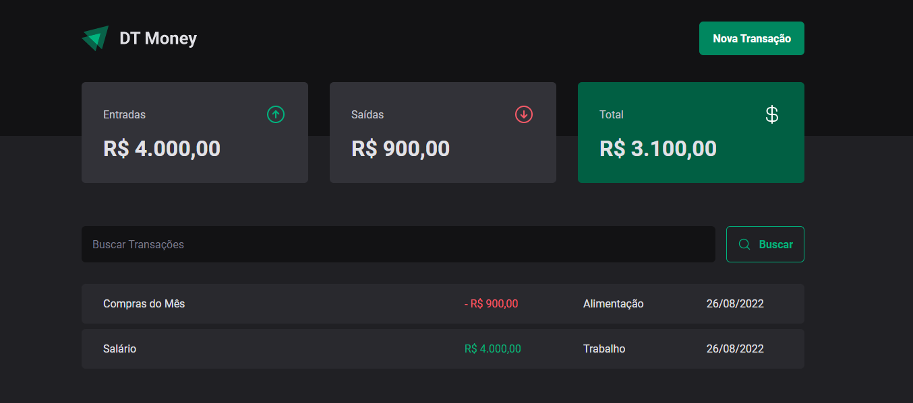
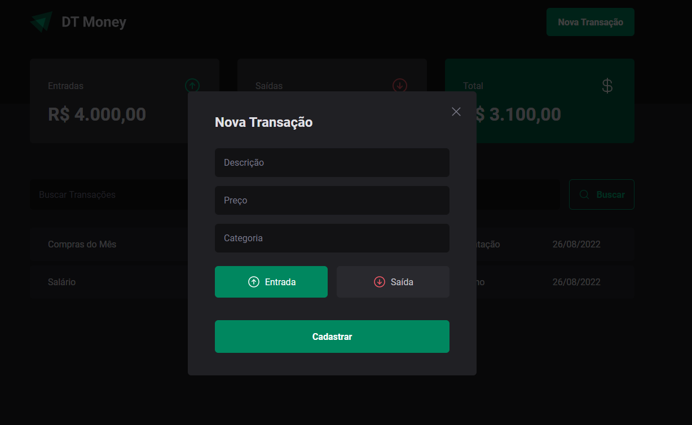
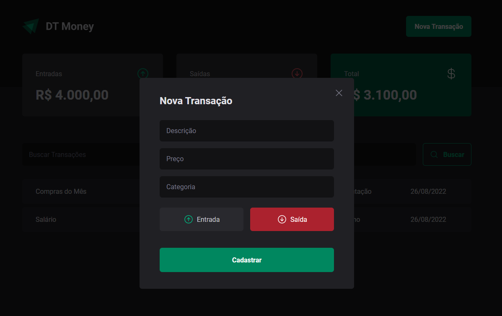

## DT Money

O projeto trata-se de uma aplicação de controle financeiro, onde é possível, listar, adicionar e pesquisar por transações.

### 🛠️ Nesse projeto foi utilizado

- Vite
- Styled Components;
- Typescript;
- Json Server (Fake API);
- Context API (TransactionContext);
- Hooks (useState, useEffect, useCallback e useMemo);
- Custom Hooks (useSummary);
- React Hook Form;
- Zod (Validação do Formulário);
- Componentes acessíveis utilizando a lib Radix UI;
- Phosphor React para os ícones;

### 🛠️ Para rodar o projeto

1. Realizar o clone ou o download do repositório;
2. Executar `npm install` ou `yarn install` para instalar as dependências;
3. Executar `npm run dev:server` ou `yarn dev:server` para rodar a fake API (Backend)
4. Executar `npm run dev` ou `yarn dev` para rodar a aplicação;

 

  

  

 

  

 

  

 

  

 

  

